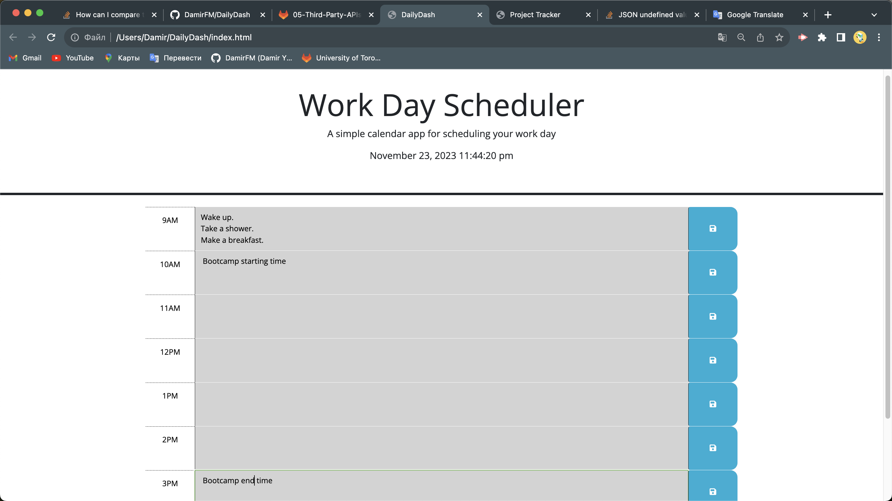

# Welcome to DailyDash 📅

DailyDash is daily planning, making it convenient to manage and keep track of activities within a structured timeline.

## Description

DailyDash is a user-friendly web application designed to assist in organizing daily tasks or events within specific time blocks. Users can input and save task details for different hours of the day, enabling efficient planning and management of activities.

## Link of deployed application.

https://damirfm.github.io/DailyDash/

## Screenshots of application

### Welcome screen

N/A

## Usage

- User can enter  task descriptions or event notes in the corresponding hour's text area.
- User click the save button to store the entered information locally for future reference.
- Blocks change color to indicate past, present, and future hours, aiding in organizing and prioritizing tasks throughout the day.

## Credits

For doing this job I used this helpful resources: 

- https://developer.mozilla.org/en-US/docs/Web/JavaScript/Reference/Operators/this
- https://api.jquery.com/on/#on-events-selector-data
- https://api.jquery.com/attr/#attr-attributeName
- https://api.jquery.com/find/#find-selector
- https://day.js.org/docs/en/display/format
- https://api.jquery.com/addClass/#addClass-className

## License

MIT License

## Badges

 

    

  

  

