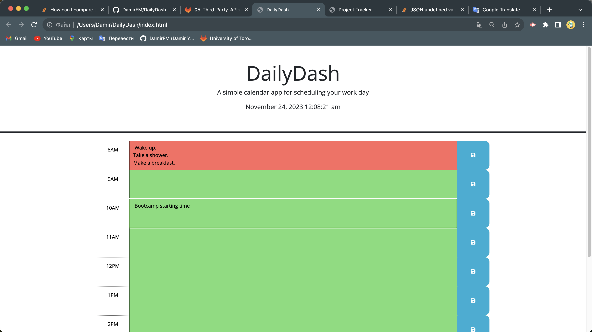

# Welcome to DailyDash

## Description

The quiz on HTML, CSS, and JS is designed to engage participants in an interactive and educational exploration of web development fundamentals. Through a series of thoughtfully crafted questions, it challenges your understanding of these core technologies. Each question presents a scenario or concept, prompting you to apply your knowledge and select the correct answer. For every each wrong answer timer will decrement 10 seconds of you time, but for correct you will get 100 points.

## Link of deployed application.

https://damirfm.github.io/CodeCrunch-Quiz/

## Screenshots of application

### Welcome screen

### Question page

### Correct answer alert

### Next question

### Next question

### Finish quiz alert

### User name input

### List of saved scores

## Installation

N/A

## Usage

To see the this codebase, you can review the updated HTML and CSS files here or clone this repo into your workstation. For your convenience, you can also check the ISSUES of this project. There you will see a list of topics that have been changed.

## Credits

For doing this job I used this helpful resources: 

- https://www.w3schools.com/jsref/met_win_clearinterval.asp 
- https://developer.mozilla.org/en-US/docs/Web/API/Window/localStorage
- https://developer.mozilla.org/en-US/docs/Web/API/Node/appendChild
- https://developer.mozilla.org/en-US/docs/Web/API/EventTarget/addEventListener
- https://developer.mozilla.org/en-US/docs/Web/API/Event/preventDefault
## License

MIT License

## Badges

    

  

  